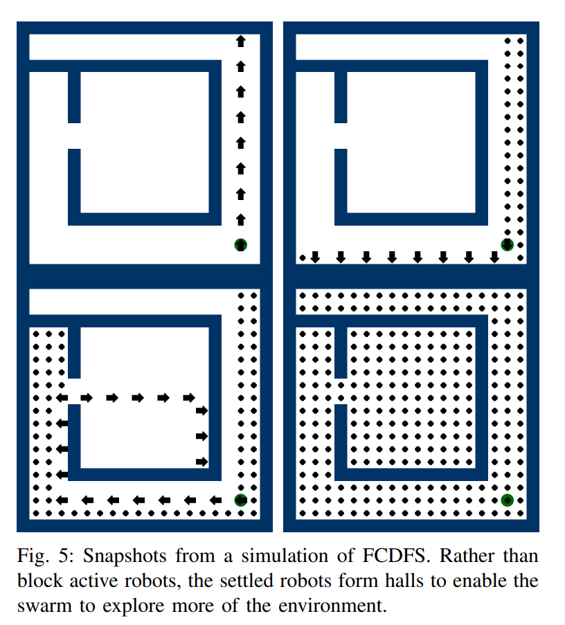
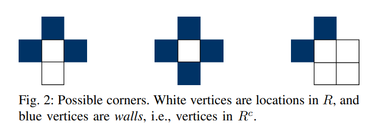
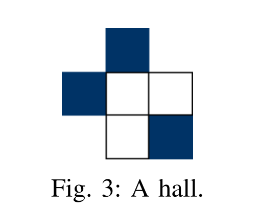
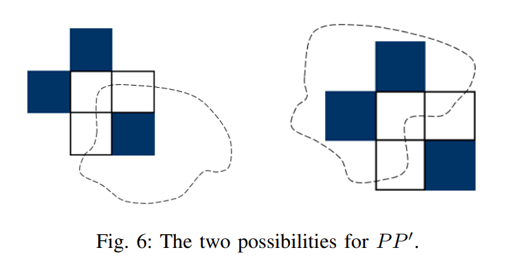
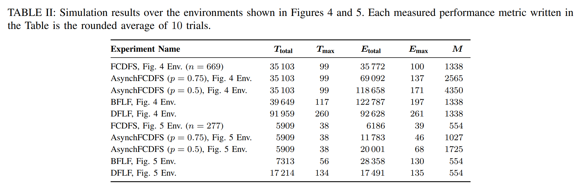
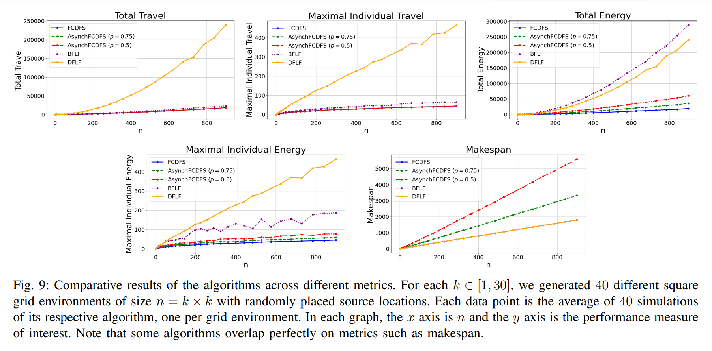

\newpage

# Algoritmus

Az algoritmus célja az egyszerűen összekapcsolt tulajdonság fenntartása azáltal, hogy a robotok csak olyan sarkokban állnak meg, amelyek garantáltan nem osztják több részre a teret. Ez a módszer a környezet aktív módosításával indirekt információátadást valósít meg a robotok között.

{ width=80% } \

## FCDFS

Az algoritmus minden robot esetében az alábbi lépéseket hajtja végre:

1. **Elsődleges és másodlagos irány kiválasztása**:

- Az elsődleges irány egy előre meghatározott irány (például észak). A másodlagos irány mindig az elsődlegeshez képest 90 fokos szögben az órajárás irányával megegyező irány elforgatott.

2. **Mozgási szabályok**:
   - A következő feltételek közül csak az első igazat hajtja végre a robot:
     - **Ha az elsődleges irány szabad**, akkor arra halad tovább.
     - **Ha az elsődleges irány foglalt**, de a másodlagos irány szabad, akkor a másodlagos irányba mozog.
     - **Ha legalább három szomszédos cella foglalt** (akár megállt robotok, akár fal által), a robot megáll.
       - Ebben az esetben, mivel sem az elsődleges, sem a másodlagos irányba nem tud lépni, biztosan legalább két cella foglalt a három közül.
     - **Ha a robot két lépéssel korábban egy diagonális cellán állt, vagy a diagonális cella jelenleg szabad**, akkor a robot egy olyan sarokban van, ahol megállhat.
       - Ez az eset akkor következik be, ha eddig legalább két, de kevesebb mint három szomszédos cella volt foglalt, így biztosan pontosan két irány szabad.
     - **Egyébként, ha a robot egy kanyarban van, ahol nem állhat meg**, új irányt választ az elsődleges irány számára, és lépést tesz.
       - Az új irány nem lehet az, ahonnan a robot az aktuális pozícióba érkezett.

### Indirekt információátadás és egyszerűsített kommunikáció

Az algoritmus alapja az indirekt kommunikáció, amely a környezet módosításával történik. Például, amikor egy robot megáll, ez a lépés automatikusan irányítja a többi robot mozgását, mivel egy részét lezárja a térnek. Ezt a módszert a **Stigmergy**(angol szó) fogalma írja le, amelyet a természetből, például a hangyák viselkedéséből merítettek.

### Példák az esetekre

1. **Elsődleges irány szabad**: A robot az előre kijelölt irányba mozog, például észak felé.
2. **Sarokban megállás**: A robot felismeri, hogy egy olyan pozícióban van, ahol pontosan két szomszédos cella szabad. Ekkor megáll.
3. **Kanyar elhagyása**: A robot a kanyarban új irányt választ, amely biztosítja az előrehaladást.

## Megjegyzések

Az **FCDFS** algoritmus biztosítja, hogy:

- A robotok egyenletesen oszoljanak el a térben, miközben megőrzik a környezet egyszerűen összekapcsolt topológiáját.
- Az algoritmus decentralizált, így egyszerű, kevés erőforrással rendelkező robotok is végre tudják hajtani.
- Az energiahatékonyság maximalizálható egyszerűen összekapcsolt környezetekben.

### Lehetséges sarkok

{ width=90% } \

Az alábbiakban bemutatjuk, hogyan azonosíthatók azok a sarkok, amelyek megfelelnek az algoritmus követelményeinek. A sarkok kiválasztásának biztosítania kell, hogy a robotok ne osszák fel a tér összefüggőségét, és a letelepedési feltételek teljesüljenek. Azt a sarkot, amely feloszta a tér összefüggőségét, **kanyarnak** nevezzük.

### Diagonális elem

Egy sarokban állva, ahol két diagonálisan szomszédos elem blokkol, a **diagonális elem** az a pont, amely:

- A sarok pontjától **3 Manhattan távolságra** van.
- A sarokban lévő robottól **2 Manhattan távolságra** található.

{ width=40% } \

**Formálisan:**  
Legyen $h = (hx, hy)$ egy robot aktuális pozíciója, és legyenek $p_i = (px_i, py_i), i \in \{0, 1, 2, 3, 4\}$ a $h$-hoz közvetlenül szomszédos blokkoló elemek. Tegyük fel, hogy ezek száma $hn$. A diagonális elem a következőképpen határozható meg:

$$diag(h) = \sum_{i = 1}^{hn} (hx - px_i, hy - py_i)$$

### A kanyarok sarokpontjai elvágó pontok

Ha a pályára gráfként tekintünk, ahol az élek a szabad cellák között a Manhattan-távolság alapján ($= 1$) húzhatók, akkor egy eredetileg egyszerűen összekapcsolt tér egy összefüggő gráfot alkot.

#### A bizonyítás vázlata:

1. **Feltételezés:**  
   Tegyük fel, hogy egy kanyar nem elvágópont.
2. **Következtetés:**

   - Ebben az esetben létezik legalább két különböző út, amely összeköti a kanyar melletti pontokat a tér többi részével.
   - A kanyar két ága máshol is összekapcsolódna, mint a sarok elem, körbezárva a diagonális elemet vagy a diagonálissal szembeni sarkot.

3. **Ellentmondás:**  
   Ez ellentmond az eredeti feltételnek, miszerint a tér egyszerűen összekapcsolt. Ebben az esetben ugyanis a falak és a megállt robotok alkotta rész nem alkotna összefüggő gráfot, mivel a diagonális elem nem lenne összeköthető a sarok elemekkel. Az illusztrációban ez jól látható.

**Formális bizonyítás:** Az eredeti cikkben megtalálható [@amir2024time].

{ width=50% } \

### Optimalitás

Az algoritmus során:

- Minden robot optimális úton halad a végcéljához.
- Minden körben minden robot lép egyet, és ez garantálja, hogy:
  - A **maximális mozgások száma** (\( T\_{max} \)) optimális.
  - Az **összes mozgás száma** (\( T\_{total} \)) optimális.
  - A robotok **összes energiafogyasztása** és **maximális energiafogyasztása** is optimális, mivel minden robot minden körben lép, és egy kör alatt megáll.

Ezáltal az algoritmus **teljesítési ideje** is optimális.

**A bizonyítás teljes verziója:** Lásd az eredeti cikkben [@amir2024time].

\newpage

## AFCDFS

Az [FCDFS](#fcdfs) algoritmus aszinkron változata, amely jobban közelíti a valóságot, hiszen a robotok nem egyszerre lépnek, hanem egymástól "függetlenül" tudnak mozgást végrehajtani. A szimulációban ez azt jelenti, hogy egy adott körben egy robot $p$ valószínűséggel lép.

A szinkronizált lépések implicit információt biztosítottak (például garantálták, hogy ütközés nem lehetséges), amit az aszinkron változatban nem tudunk kihasználni. Emiatt itt **1 bit kommunikációra** van szükség körönként, amely lehetővé teszi a megállt és a még aktív robotok megkülönböztetését.

Az algoritmus lépései hasonlóak a [szinkron esetben](#fcdfs) ismertetett lépésekhez, néhány kiegészítéssel:

- Nemcsak azt vizsgáljuk, hogy egy mező foglalt-e, hanem azt is, hogy azt éppen egy **aktív robot** foglalja-e. Ez az alapfeladatban nem fordulhatott elő, mivel ott minden robot egyszerre lépett, két körönként jelentek meg új robotok, és mindegyik optimális úton haladt a célja felé.
- Az aszinkron esetben azonban az aktív robotok közvetlenül egymás mellé kerülhetnek. Ilyenkor a hátrébb lévő robot várakozik, amíg az előtte lévő robot elmozdul, vagy letelepedik és inaktívvá válik.

A gyakorlatban ez a fajta kommunikáció valami olyasmi lehet, hogy az aktív robotok "broadcast"-okják hogy aktívak, azzal, hogy aktívan fényt bocsátanak ki, és a robotok az minden körben ilyen robotokat akarnak megfigyelni.

### Optimalitás

Az [AFCDFS](#afcdfs) algoritmus során minden robot ugyanazon az optimális úton halad a célja felé, mint az [FCDFS](#fcdfs) algoritmus esetében. Ezért az algoritmus **maximális lépés** ($T_{max}$) és **összes lépés** $T_{total}$) szempontjából optimális.

#### Energia és idő optimalitás

Az energia- és időoptimalitásra azt mondhatjuk, hogy az algoritmus **asszimptotikusan optimális**. Ez azt jelenti, hogy:

- Ahogy a járható cellák száma($n$) közelíti a végtelent, a robotok összes és maximális energiafelhasználása tart az optimális értékhez.
- A teljesítési idő szintén asszimptotikusan optimális lesz.

#### Formális definíció

Legyen $\alpha = \frac{1}{2}(1 - \sqrt{1 - p})$, ahol $p$ az AFCDFS paramétere. Ekkor:

$$M \leq \left(\frac{1}{\alpha} + o(1)\right) n$$

$$E_{max} \leq 2\left(1 + \alpha + o(1)\right) \max_{v \in R} dist(s, v)$$

Ezek a feltételek $n \to \infty$ esetén nagy valószínűséggel teljesülnek. Ahogy $n \to \infty$, a valószínűség $1$-hez tart.

### Megjegyzés

Az AFCDFS algoritmus:

- Az **aszinkron működésből fakadó problémákat** (például az aktív robotok összeütközését) egy kis mértékű kommunikációval kezeli.
- Garantálja az optimális úton való haladást, ugyanakkor aszinkron viselkedés esetén is hatékonyan közelíti az energia- és időoptimalitást, különösen nagy környezetekben.

# Eredmények és összehasonlítás

Több példára futtatták az FCDFS és AFCDFS algoritmusokat az eredeti cikkben [@amir2024time], valamint ezt a [saját szimulációinkkal](https://kristofy.github.io/uniform-dispersion-problem/simulation) is megerősítettük. Az eredeti cikk méréseihez hozzávették az eddig ismert megoldásokat is, például Hsiang et al. DFLF és BFLF algoritmusait [@hsiang2004].

Az összehasonlítás eredményeit a két már látott pályán (Figure 4 és 5) futtaták, amelyet **Table II** táblázat foglalja össze. Ezeket a szimulációkat saját rendszerünkben is [lefuttathatjuk](https://kristofy.github.io/uniform-dispersion-problem/simulation).

Az algoritmusok skálázhatóságát a **Figure 9** ábra mutatja be.

A következő fontos megállapítások szűrhetők le az eredményekből:

1. **Az FCDFS algoritmus teljesítménye**:

   - Az FCDFS algoritmus minden metrika alapján a legjobb eredményeket éri el.
   - Az öt fő kritérium alapján az algoritmus **optimális**:
     - Maximális mozgás ($T_{max}$)
     - Összes mozgás ($T_{total}$)
     - Maximális energiafogyasztás ($E_{max}$)
     - Összes energiafogyasztás ($E_{total}$)
     - Elvégzési idő ($M$ Makespan)

2. **Az AFCDFS algoritmus teljesítménye**:
   - Az asszinkron AFCDFS algoritmus jobban teljesít energiaoptimalizálás szempontjából, mint az eddig ismert általános megoldások, például a DFLF és BFLF algoritmusok.
   - Ez az eredmény várható volt, mivel az energiaoptimalitás megoldása általános esetben nem valósítható meg konstans látótávolság mellett [^1].

[^1]: Az energiaoptimalitás megoldása általános esetben nem lehetséges konstans látótávolság mellett.

# Összefoglalás

Az FCDFS és AFCDFS algoritmusok részletes elemzése és összehasonlítása alapján megállapítható, hogy mindkét megközelítés kiemelkedően jól teljesít a robotok egyenletes szórásának problémájában, különböző egyszeresen összekapcsolt környezetekben. Az FCDFS algoritmus minden vizsgált metrika alapján optimális, így szinkron környezetben ideális választás, például, amikor a feladatot megoldhatjuk előre, és nem valós időben kell megoldanunk a szétszórás problémáját. Az AFCDFS algoritmus, amely az aszinkron működési modellekhez alkalmazkodik, szintén hatékonyan közelíti az optimális eredményeket, különösen az energiafogyasztás szempontjából.

A két algoritmus kifejezetten egyszerű fizikai képességekkel rendelkező robotok számára készült, amely egy nagy előnyt, hiszen a feltérképezni kívánt területtel arányos, tehát nagy mennyiségű robotra van szükség.

# Jövőbeli munkák

Az algoritmusok további fejlesztése és alkalmazási lehetőségeinek vizsgálata számos érdekes irányt kínál:

**Különböző topológiák elemzése:**  
A bemutatott algoritmusok viselkedésének tanulmányozása összetettebb, nem egyszerűen összekapcsolt környezetekben, például akadályokkal teli vagy dinamikusan változó tereken.

**Továbbfejlesztett aszinkron modellek:**  
Az AFCDFS algoritmus továbbfejlesztése olyan forgatókönyvekhez, ahol az aszinkron működés erősen szabálytalan, és a robotok kommunikációs képességei korlátozottabbak.

**Energiahatékonyság további optimalizálása:**
Olyan stratégiák kidolgozása, amelyek az energiafogyasztást nemcsak aszimptotikusan, hanem kisebb méretű környezetekben is minimalizálják.

**Hardvermegvalósítás és valós környezeti tesztek:**  
Az algoritmusok fizikai robotplatformokra történő implementálása és valós környezetekben való tesztelése, beleértve a robotok szenzorainak és aktuátorainak korlátait is. Ezen felük az algoritmus hibakezelő képességekkel való kiegészítése.

Ezek az irányok nemcsak a jelenlegi algoritmusok továbbfejlesztésére adnak lehetőséget, hanem hozzájárulhatnak az autonóm rajrobotikai rendszerek szélesebb körű alkalmazhatóságához, különösen dinamikusan változó és bizonytalan környezetekben.

\newpage

# References
